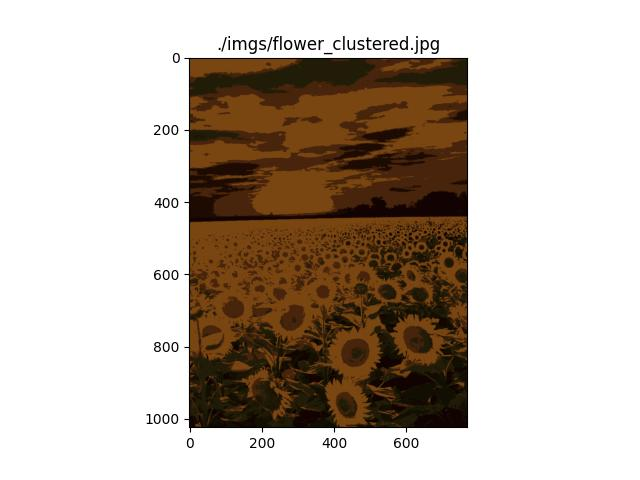
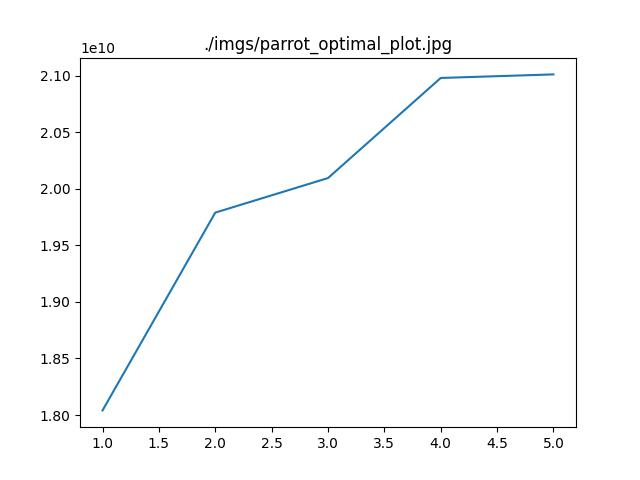
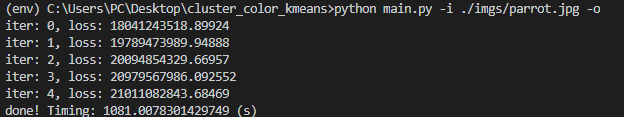

# cluster_color_kmeans

# Description

- Load image, cluster the color then save the result in `./imgs`
- *(New)* find the optimal color number of image

# How to run?

- Show help: `python main.py --help`

- Run clustering: `python main.py -i ./imgs/parrot.jpg`

- Run finding optimal: `python main.py -i ./imgs/parrot.jpg -o`

# Terminal command

- Create virtual enviroment: `virtualenv env`
- Activate virtual enviroment on **Window**: `cd env/Scripts` + `activate`
- Activate  virtual enviroment on **Linux**: `source env/bin/activate`
- Dectivate virtual enviroment: `deactivate`
- Export required libraries: `pip freeze > requirments.txt`
- Install all required libraries: `pip install -r requirements.txt`

# References

https://www.machinelearningplus.com/predictive-modeling/k-means-clustering/

https://www.askpython.com/python/examples/k-means-clustering-from-scratch

https://medium.com/@rishit.dagli/build-k-means-from-scratch-in-python-e46bf68aa875

https://analyticsarora.com/k-means-for-beginners-how-to-build-from-scratch-in-python/
